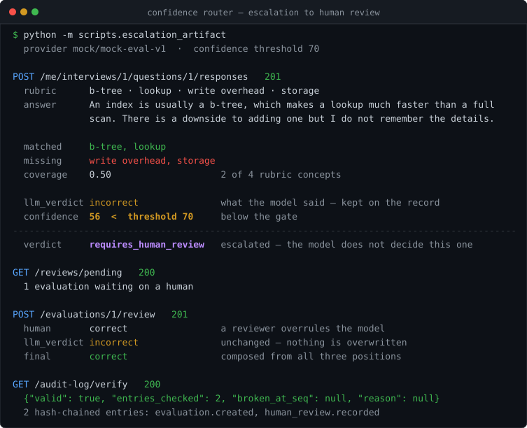

# Interview Response Evaluation Platform

[](https://github.com/malex4hire/interview-eval-platform/actions/workflows/ci.yml)

Backend + API for automated technical interviews. Candidates answer questions
(text or audio), an LLM pipeline scores them against a rubric, low-confidence
results go to a human, and everything gets written to an append-only audit log.

The interesting part isn't the CRUD. It's what happens when a model decides
something about a person: the model's verdict and the routed verdict are stored
separately, nothing is ever overwritten, and the audit log is built so tampering
is detectable even by someone with database access.



That image is a recording, not a mock-up. `python -m scripts.escalation_artifact`
re-drives the API against a throwaway database and redraws it, and
`tests/test_escalation_artifact.py::test_a_fresh_regeneration_matches_the_committed_artifact`
fails if a fresh render and the committed one disagree about anything other than
a timestamp. The transcript it was drawn from is committed beside it, in
[`docs/escalation-run.json`](docs/escalation-run.json).

```bash
git clone https://github.com/malex4hire/interview-eval-platform
cd interview-eval-platform
./demo.sh
```

One command, no credential, nothing to answer. It builds the virtualenv,
creates the schema with its append-only triggers, seeds two tenants' interviews,
and serves the API with the human-review queue already populated.

## Setup

`./demo.sh` is the whole of it, and re-running it is safe — it seeds only when
the database holds no evaluations, so a recorded verdict is never overwritten.
The steps it runs, if you would rather do them by hand:

```bash
python3 -m venv .venv && source .venv/bin/activate
pip install -r requirements.txt

python3 -m scripts.init_db
python3 -m scripts.seed

uvicorn app.main:app --reload
```

Docs at http://127.0.0.1:8000/docs. Python 3.10+, SQLite by default.

```bash
pytest
```

### Seed users

Password for all of them: `demo-password-123`

| Email | Role |
|---|---|
| admin.acme@example.com | org_admin (tenant A) |
| admin.globex@example.com | org_admin (tenant B) |
| cand.jordan@example.com | candidate (A) |
| cand.priya@example.com | candidate (A) |
| cand.luis@example.com | candidate (A) |
| cand.wei@example.com | candidate (B) |

Two admins so you can check that tenant isolation actually works.

## What this repository claims, and what proves it

A passing badge says the happy path ran. It says nothing about whether the
paragraph above it is true. So every capability claim in this README is
registered here against the gate that proves it, and the register itself is
tested: `tests/test_readme_claims.py` fails if a claim names an artifact that
does not exist, a test that pytest cannot collect, or a gate carrying a skip
marker. The `claims` job in CI then runs exactly the node ids this table names,
so a claim whose gate is red cannot merge.

Two halves, deliberately split — the tests catch a gate that stopped existing,
which a green suite cannot see; CI catches a gate that stopped passing.

<!-- claims:begin -->
| # | Claim | Implemented in | Proven by |
|---|---|---|---|
| C1 | One command takes a clean clone to a running API carrying seed data and completed evaluations | `demo.sh` | `tests/test_one_command_bringup.py::test_a_seeded_evaluation_carries_a_routing_disposition`, `.github/workflows/ci.yml::demo` |
| C2 | Nothing in the demo path asks the operator a question or requires an API credential | `demo.sh`, `app/providers/mock.py` | `tests/test_one_command_bringup.py::test_the_one_command_needs_no_api_credential`, `tests/test_one_command_bringup.py::test_the_command_asked_the_operator_for_nothing` |
| C3 | An evaluation whose confidence falls below the threshold is routed to a human instead of standing as the outcome | `app/domain/verdicts.py` | `tests/test_evaluation.py::test_ambiguous_answer_routes_to_human_review` |
| C4 | Confidence models certainty, not correctness: a decisively wrong answer stands as `incorrect` and is not escalated | `app/domain/scoring.py` | `tests/test_evaluation.py::test_decisively_wrong_answer_is_incorrect_not_flagged`, `tests/test_documented_behaviour.py::test_confidence_is_certainty_not_score` |
| C5 | The routing table in this README is the table the seed actually produces | `scripts/seed.py` | `tests/test_documented_behaviour.py::test_the_readme_routing_table_matches_the_seeded_run` |
| C6 | The seed exercises every branch of the router, not only the passing one | `scripts/seed.py` | `tests/test_documented_behaviour.py::test_the_seed_exercises_every_routing_disposition` |
| C7 | Only a flagged evaluation can be overridden; a high-confidence verdict cannot be overturned by hand | `app/domain/verdicts.py` | `tests/test_human_review.py::test_high_confidence_evaluation_cannot_be_overridden` |
| C8 | A human review is a third record, and the model's own verdict survives it unchanged | `app/models.py`, `app/services/review_service.py` | `tests/test_human_review.py::test_human_verdict_supersedes_without_erasing_the_model_verdict` |
| C9 | Re-evaluating appends a version; the previous verdict keeps its confidence and raw output | `app/services/evaluation_service.py` | `tests/test_evaluation.py::test_reevaluation_appends_a_version_and_supersedes_the_previous` |
| C10 | The audit log is append-only in the database, not by application convention | `app/core/database.py` | `tests/test_audit_chain.py::test_database_rejects_update_of_an_audit_row`, `tests/test_audit_chain.py::test_database_rejects_delete_of_an_audit_row` |
| C11 | An audit row edited in place is detectable, even by someone with direct database access | `app/domain/hashing.py` | `tests/test_audit_chain.py::test_verifier_detects_an_edited_payload` |
| C12 | A deleted audit row is detectable as a sequence gap | `app/domain/hashing.py` | `tests/test_audit_chain.py::test_verifier_detects_a_deleted_entry` |
| C13 | Recomputing a tampered row's own hash does not repair the chain — the next entry still breaks | `app/domain/hashing.py` | `tests/test_audit_chain.py::test_verifier_detects_a_rewritten_hash` |
| C14 | One tenant cannot read or act on another's data, and a cross-tenant read returns 404 rather than 403 | `app/repositories.py` | `tests/test_interviews.py::test_interview_is_invisible_to_another_admin`, `tests/test_human_review.py::test_another_tenant_cannot_review` |
| C15 | A candidate never sees the rubric — not in the question, not in their feedback | `app/schemas.py` | `tests/test_interviews.py::test_candidate_questions_omit_the_rubric`, `tests/test_evaluation.py::test_candidate_reads_own_feedback_without_the_answer_key` |
| C16 | Switching evaluation providers is a configuration change, not a change to the pipeline | `app/providers/registry.py` | `tests/test_documented_behaviour.py::test_the_provider_is_selected_by_name_not_by_editing_the_pipeline` |
| C17 | The mock provider is deterministic: the same answer always produces the same evaluation | `app/providers/mock.py` | `tests/test_documented_behaviour.py::test_the_mock_provider_is_deterministic` |
| C18 | Every evaluation records its cost and latency in a ledger separate from the verdict | `app/models.py` | `tests/test_evaluation.py::test_llm_call_ledger_records_cost_for_every_evaluation` |
| C19 | An audio answer is transcribed and then evaluated by the same pipeline as a typed one | `app/providers/mock.py` | `tests/test_evaluation.py::test_audio_submission_is_transcribed_then_evaluated` |
| C20 | The escalation image above is regenerated from a real run and fails the suite if it drifts | `scripts/escalation_artifact.py` | `tests/test_escalation_artifact.py::test_a_fresh_regeneration_matches_the_committed_artifact` |
<!-- claims:end -->

**The register is capped at 20 claims.** This repository is depth evidence, not
the first thing a reviewer reads, and README surface competes with the artifact
above the fold for the only thirty seconds that matter. Twenty is already more
than that budget supports, so the cap exists to stop it growing rather than to
shrink it. Raising `REGISTER_CAP` requires a decision entry in
[`docs/DECISIONS.md`](docs/DECISIONS.md) in the same commit —
`tests/test_readme_claims.py::test_no_commit_raises_the_cap_without_a_decision_entry`
walks the commit range and fails if one goes up without the other.

**What this does not do.** The register is curated: nothing automatically
notices a new capability claim written into the prose and never added here. A
prose scanner was considered and rejected — it would have to guess what counts
as a claim, and a check that cries wolf gets switched off by whoever trusts it
next. Adding the row is part of writing the sentence.

## Confidence threshold

`CONFIDENCE_THRESHOLD`, default 70. Below it, an evaluation is routed to
`requires_human_review` instead of standing on its own.

Confidence is certainty, not score. The mock provider derives it from how
decisive the rubric coverage is — 0% and 100% are both easy calls and score
high, ~50% is genuinely unclear and scores low. So a confidently wrong answer
(`incorrect` at 100) is normal and correct. If confidence just restated the
score, the review queue would fill up with obvious failures and miss the cases
where a human actually helps.

What the seed data actually produces:

<!-- routing-table:begin -->
| Seeded answer | Rubric matched | Confidence | LLM verdict | Routed |
|---|---|---|---|---|
| idempotency, near-complete | 4 / 5 | 84 | correct | correct |
| idempotency, nothing relevant | 0 / 5 | 100 | incorrect | incorrect |
| indexing, read path only | 2 / 4 | 54 | incorrect | requires_human_review |
| consistency, pattern half-named | 2 / 4 | 58 | incorrect | requires_human_review |
| evaluation, complete | 4 / 4 | 99 | correct | correct |
| logging, complete, via audio | 4 / 4 | 100 | correct | correct |
<!-- routing-table:end -->

These numbers are not transcribed by hand.
`tests/test_documented_behaviour.py::test_the_readme_routing_table_matches_the_seeded_run`
runs the seed and fails if this table and the database disagree. That gate is
how the two wrong rows it replaced were found: the table used to claim the
strong answer scored 1.00/100, when the seeded answer covers four of five
concepts and scores 84.

## API

Bearer token on everything except register/login and `/health`. Anything
outside your tenant returns 404 rather than 403, so you can't confirm a
resource exists by probing for it.

### Auth
```
POST /auth/register     {email, password, role, full_name?, tenant_admin_id?}
POST /auth/login        -> {access_token, role, user_id, tenant_admin_id}
GET  /auth/me
```

### org_admin
```
POST /interviews                          {title, description?, questions[]}
GET  /interviews
GET  /interviews/{id}
POST /interviews/{id}/assignments         {candidate_id}
GET  /interviews/{id}/responses           responses + current eval + history
POST /responses/{id}/reevaluate           {reason}  -> new version
GET  /reviews/pending
POST /evaluations/{id}/review             {verdict, notes?}  409 if not flagged
GET  /interviews/{id}/audit-log
GET  /audit-log
GET  /audit-log/verify
```

### candidate
```
GET  /me/interviews
GET  /me/interviews/{id}/questions
POST /me/interviews/{id}/questions/{qid}/responses    multipart: text/audio
GET  /me/responses/{id}/evaluation
```

### Try it

```bash
BASE=http://127.0.0.1:8000
ADMIN=$(curl -s $BASE/auth/login -H 'Content-Type: application/json' \
  -d '{"email":"admin.acme@example.com","password":"demo-password-123"}' \
  | python3 -c 'import sys,json;print(json.load(sys.stdin)["access_token"])')

curl -s $BASE/reviews/pending  -H "Authorization: Bearer $ADMIN"
curl -s $BASE/audit-log/verify -H "Authorization: Bearer $ADMIN"
```

## Data model

```
users ──┬─< interviews ──< questions ──< responses ──< evaluations ──< human_reviews
        │      owner_admin_id = tenant                     │
        ├─< interview_assignments                          └──< llm_calls
        └─< audit_log
```

No organisations table. The org_admin is the tenant: `interviews.owner_admin_id`
is the scoping key, it rides in the JWT, and every query filters on it in
`repositories.py` so route handlers can't skip it.

Evaluations are versioned. Re-evaluating appends v2 and flips `is_current`;
v1 keeps its verdict, confidence and raw output. Otherwise "why did this
candidate's result change" has no answer.

Two verdict columns: `llm_verdict` is what the model said, `verdict` is the
state after the confidence gate. Merging them would throw away the model's
actual output every time routing kicked in. A human review is a third row
rather than an edit, so all three positions survive. `final_verdict` composes
them.

`llm_calls` is separate from `evaluations` — cost and latency are operational,
the verdict is a domain record, and a failed call that produced no evaluation
still needs to land somewhere.

## Audit log

```
entry_hash = SHA256("v1|prev_hash|seq|event_type|subject_type|subject_id|actor_id|canonical_json(payload)|created_at")
```

Sequence is per-tenant, gap-free, starts at 1 with `prev_hash` = 64 zeros.
Payload carries the prompt, raw output, matched/missing concepts, confidence,
the threshold at the time, and both verdicts. Written in the same transaction
as the evaluation it describes.

Append-only is enforced in the database: triggers on SQLite, revoked grants on
Postgres. Application-level discipline isn't enough — anything reachable
through the ORM can be bypassed.

`verify_chain()` reports three different failures, because they mean different
things: a sequence gap means a row was removed, a `prev_hash` mismatch means
history was re-linked, an `entry_hash` mismatch means a row was edited in place.

The tests drop the triggers first, to stand in for someone with direct database
access, then check that verification fails on an edited payload, a deleted
entry, and a rewritten hash. The rewritten-hash case is the interesting one:
recomputing the digest still breaks the next entry's `prev_hash`.

Interview-scoped exports carry the tenant-wide verification result. A filtered
slice has legitimate sequence gaps, so verifying the slice on its own would
report tampering that didn't happen.

## LLM abstraction

```python
class EvaluationProvider(Protocol):
    name: str
    model: str
    def evaluate(self, request: EvaluationRequest) -> EvaluationResult: ...

class Transcriber(Protocol):
    name: str
    def transcribe(self, audio_path: str) -> TranscriptionResult: ...
```

Switching providers is `LLM_PROVIDER=...`, not a code change. Registration
points for real providers are marked in `providers/registry.py`.

The provider returns a verdict, explanation, confidence and raw output — that's
it. Thresholding and routing live in `domain/verdicts.py`, otherwise every new
provider could quietly redefine when a human gets pulled in.

The mock is deterministic. Same input, same evaluation, every time — a random
mock makes tests flaky and audit replays unreproducible.

`MockTranscriber` reads the uploaded file as text when it decodes as UTF-8,
which is how the fixtures carry audio answers without an STT dependency.
Binary uploads get a deterministic placeholder so the path still works.

## Decisions

| # | Decision |
|---|---|
| D-1 | org_admin is the tenant, no organisations table |
| D-2 | assignment table gates candidate visibility |
| D-3 | global confidence threshold via env |
| D-4 | evaluation runs synchronously on submit |
| D-5 | evaluations versioned, never overwritten |
| D-6 | audit scope: evaluations + human reviews |
| D-7 | only flagged evaluations can be overridden |
| D-8 | audit export is a full JSON array + verification envelope |

Smaller calls worth knowing about:

- Passwords use stdlib PBKDF2-HMAC-SHA256 rather than passlib/bcrypt. One less
  compiled dependency. Work factor is `PBKDF2_ITERATIONS` (480k default); the
  test suite drops it to 1000, which takes a full run from ~7 minutes to
  seconds. The count is stored in each hash, so changing it doesn't invalidate
  anything.
- PyJWT instead of python-jose.
- Login hashes against a dummy value when the user doesn't exist, so timing
  doesn't leak which emails are registered.
- Uploaded filenames are never used as paths. UUID name, allowlisted suffix.
  Otherwise the upload endpoint is an arbitrary file write.
- Candidates don't see `expected_concepts` or `missing_concepts`. The rubric
  shouldn't be reconstructable from feedback.
- One response per question per candidate. A 409 is better than silently
  overwriting something already scored and audited.

## Layout

```
app/
  domain/          hashing, scoring, verdicts — stdlib only
  providers/       protocols + mock implementations
  services/        evaluation pipeline, audit, review, storage
  repositories.py  tenant-scoped queries
  models.py        schema
  schemas.py       pydantic request/response
  api/             deps + routers
scripts/           init_db, seed
tests/
```

`app/domain/` has no third-party imports. The hash chain and verdict routing
are the parts that have to be right, and they're testable without a database
or a framework.

## Not done

Scoped out per the brief, with where each would attach:

- Async evaluation. `EvaluationService.evaluate_response()` is plain Python
  taking a session, so moving it behind a queue changes the caller — submit
  would return 202 with a pending status.
- Real providers. Hooks in `providers/registry.py`. Each needs a timeout,
  bounded retry and a breaker; `LLMCall` already records failures.
- Alembic. `scripts/init_db.py` covers it for now; the append-only statements
  should move into the first migration.
- S3. `services/storage.py` is the only thing touching the filesystem.
- Rate limiting, refresh tokens, token revocation.
- Per-interview thresholds, separate reviewer role, scheduled chain
  verification with alerting.
